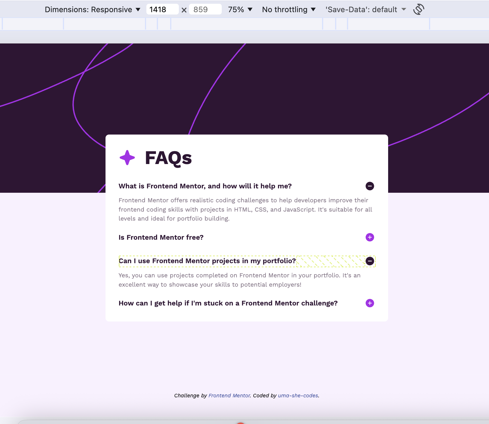
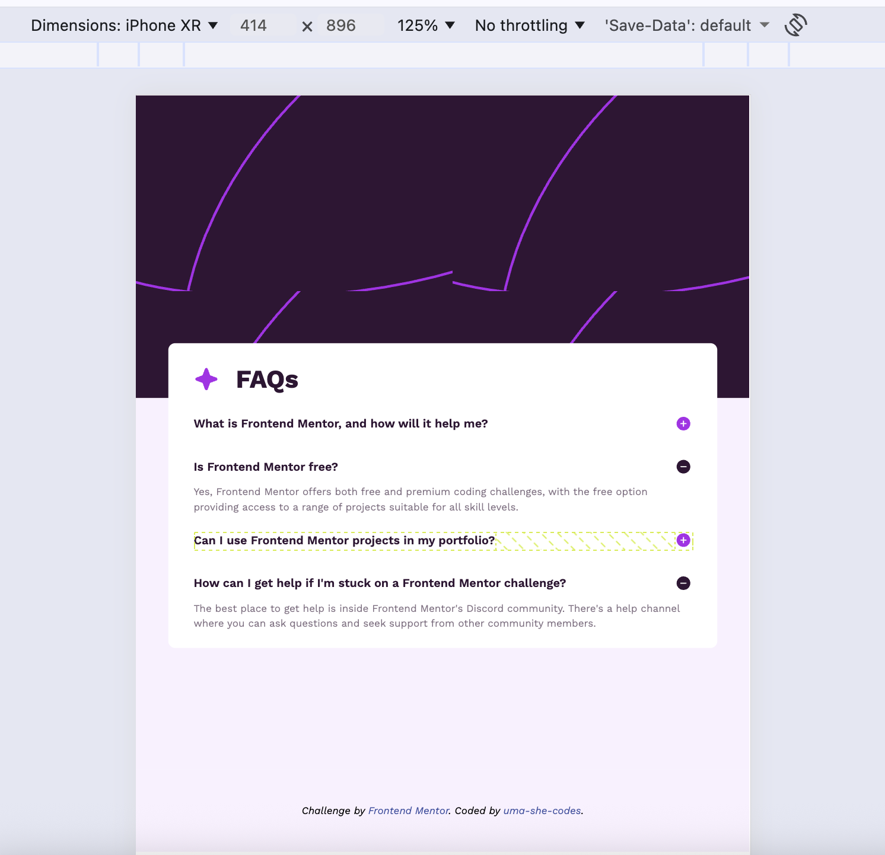

## FAQ Accordion Component

## Frontend Mentor Challenge - HTML, CSS & JavaScript Practice

This repository contains my solution to the FAQ Accordion challenge from Frontend Mentor — a responsive, interactive accordion component built with semantic HTML, modern CSS, and vanilla JavaScript.

## Challenge Overview

- Your users should be able to:
  - Click on an FAQ question to reveal or hide its answer
  - Toggle icons (plus/minus) to indicate expanded/collapsed states
  - Navigate and toggle items using keyboard inputs (Enter/Space)
  - View a responsive layout for different screen sizes
  - Experience visual hover and focus states for accessibility

## Live Demo

- Live Site:

## Preview

## Built With

- HTML5 — semantic structure
- CSS3 — responsive layout, transitions, hover/focus states
- JavaScript (ES6+) — accordion toggle logic

## Features

✔ Show/hide answers on click
✔ Toggle icons (plus/minus)
✔ Accessible keyboard interaction
✔ Responsive design for mobile & desktop
✔ Hover & focus states for UI clarity

## Folder Structure

faq-accordion/

├── assets/
│ ├── images/
│ └── (other static assets)
├── index.html
├── style.css
├── script.js
└── README.md

## Implementation Notes

# HTML

- Structured UI using semantic containers and buttons for accessible click targets
- Each accordion question and answer follow a predictable pattern

# CSS

- Responsive layout matches both mobile and desktop mockups
- Uses transitions on answer containers for smooth expansion/collapse

# JavaScript

- Event delegation for click handling
- Closest ancestor detection for reliable DOM targeting
- Keyboard accessibility (Enter and Space) support

## What I Learned

This challenge helped me strengthen my:

- DOM traversal and event handling
- Semantic HTML usage
- CSS responsive layouts and transitions
- Accessible UX practices (focus and keyboard support)

## Future enhancements could include:

- Improved accessibility (ARIA attributes like aria-expanded, aria-controls)
- Smooth dynamic height animations via JS height calculations
- Unit tests for JavaScript logic

## Acknowledgements

- Challenge by Frontend Mentor
